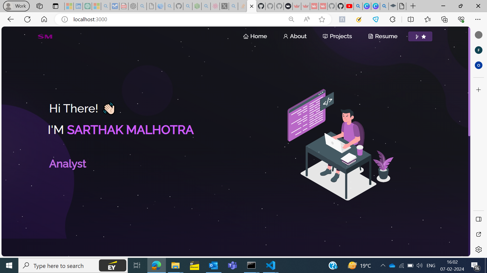

Portfolio Readme
Welcome to my portfolio repository! This project showcases my skills and projects, built using Node.js, HTML, CSS, React, and Bootstrap.

Table of Contents
Introduction
Features
Installation
Usage
Project Structure
Technologies Used
Contributing
License
Introduction
This portfolio serves as a representation of my skills, projects, and experiences. It is designed to provide visitors with an overview of my capabilities and the work I've done.

Features
Responsive Design: The portfolio is built using Bootstrap and is responsive across various devices, ensuring a seamless user experience.
Project Showcase: Display and highlight the projects I've worked on, including descriptions and links to their respective repositories or live demos.
Skills and Technologies: Showcase the programming languages, frameworks, and technologies I am proficient in.
Contact Information: Provide a way for visitors to get in touch with me.
Installation
To set up the project locally, follow these steps:

Clone the repository:

bash
Copy code
git clone https://github.com/your-username/portfolio.git
Navigate to the project directory:

bash
Copy code
cd portfolio
Install the required dependencies:

bash
Copy code
npm install
Usage
Run the development server:

bash
Copy code
npm start
Open your web browser and go to http://localhost:3000 to view the portfolio.

Customize the content in the src directory to add your projects, skills, and personal information.

Project Structure
lua
Copy code
|-- portfolio
    |-- public
    |-- src
        |-- components
        |-- images
        |-- pages
        |-- App.js
        |-- index.js
    |-- package.json
    |-- README.md
public: Contains static assets like images and the index.html file.
src: Contains the source code for the React application.
components: React components for different sections of the portfolio.
images: Store images used in the portfolio.
pages: React components for different pages of the portfolio.
App.js: Main component orchestrating the layout.
index.js: Entry point of the React application.
Technologies Used
Node.js: Backend JavaScript runtime.
React: JavaScript library for building user interfaces.
HTML and CSS: Standard web development languages.
Bootstrap: Front-end framework for design and layout.
Contributing
If you'd like to contribute to this project, please follow the steps outlined in the CONTRIBUTING.md file.
